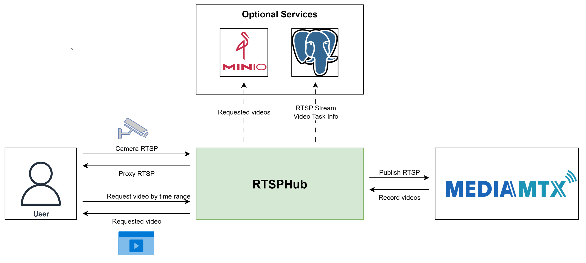

# RTSPHub

[](https://github.com/egliette/RTSPHub/actions/workflows/ci.yml)

[](https://github.com/egliette/RTSPHub/actions/workflows/publish-release.yml)

A FastAPI-based recording service that connects to RTSP streams, proxies them via MediaMTX, and provides APIs to record and store videos locally or in MinIO.



## 1. Overview

RTSPHub is a service designed for camera-related tasks and computer vision applications. It leverages [**MediaMTX**](https://github.com/bluenviron/mediamtx) and provides APIs to retrieve recorded video content based on specific time ranges - a feature not yet available in MediaMTX. This is particularly useful for:

- **Object Detection Tasks**: Extract specific video segments when objects are detected
- **Evidence Collection**: Retrieve video footage for specific time periods
- **Computer Vision Pipelines**: Access historical video data for analysis
- **Surveillance Systems**: Manage multiple camera streams efficiently

## 2. Key Features

1. **Stream Management**: Create proxy streams, monitor health, and manage streams via REST API with automatic recording
2. **Video Retrieval**: Provide API to return requested video based on time range
3. **Storage Options**: Local filesystem or MinIO object storage with presigned URLs
4. **Data Persistence**: Store stream information and task metadata in SQLite

## 3. Installation

### Using Docker Compose

1. **Clone the repository:**
   ```bash
   git clone <repository-url>
   cd RTSPHub
   ```

2. **Create environment file:**
   ```bash
   cp .env.example .env
   # Edit .env with your configuration
   ```

3. **Build and start the services:**
   ```bash
   # For development
   ./scripts/dev-compose.sh

   # For production
   ./scripts/prod-compose.sh

   # For testing
   ./scripts/test-compose.sh
   ```

4. **Access the services:**
   - RTSPHub API: http://localhost:8000
   - RTSPHub Swagger Documentation: http://localhost:8000/docs
   - MediaMTX: http://localhost:8889
   - MinIO Console: http://localhost:9001

## 4. Getting Started - Typical Workflow

Here's a typical user journey to get you started:

### Step 1: Create a Stream
First, create a proxy stream from your RTSP camera:
```bash
curl -X POST "http://localhost:8000/api/streams" \
     -H "Content-Type: application/json" \
     -d '{
       "source_uri": "rtsp://your-camera-ip:554/stream",
       "path": "camera1",
       "stream_id": "camera1"
     }'
```

### Step 2: Access Your Live Stream
Once created, you can access your stream at:
- **RTSP**: `rtsp://localhost:8554/camera1`

### Step 3: Request Video Recording
When you need a specific time range recorded:
```bash
curl -X POST "http://localhost:8000/api/video-process/tasks" \
     -H "Content-Type: application/json" \
     -d '{
       "source_rtsp_path": "camera1",
       "start_time": "2024-01-15 10:00:00",
       "end_time": "2024-01-15 10:05:00"
     }'
```

### Step 4: Get Your Video
Check task status and get your processed video:
```bash
# Check status
curl "http://localhost:8000/api/video-process/tasks/{task_id}"

# Download video (if using local storage)
# Or use the presigned URL (if using MinIO)
```

### Step 5: Clean Up
When done, remove the stream:
```bash
curl -X DELETE "http://localhost:8000/api/streams/camera1"
```

## 5. API Reference & Detailed Usage

### Available Endpoints

**Stream Management:**
- `POST /api/streams` - Create a new proxy stream
- `GET /api/streams` - List all active streams
- `DELETE /api/streams/{stream_id}` - Remove a stream
- `GET /api/streams/{stream_id}/health` - Check stream health

**Video Processing:**
- `POST /api/video-process/tasks` - Create video processing task
- `GET /api/video-process/tasks` - List all video tasks
- `GET /api/video-process/tasks/{task_id}` - Get task status
- `DELETE /api/video-process/tasks/{task_id}` - Delete task
- `DELETE /api/video-process/tasks/{task_id}/video` - Delete video file based on task ID

### Stream Management Workflow

1. **Create a Stream**
   ```bash
   curl -X POST "http://localhost:8000/api/streams" \
        -H "Content-Type: application/json" \
        -d '{
          "source_uri": "rtsp://your-camera-ip:554/stream",
          "path": "camera1",
          "stream_id": "camera1"
        }'
   ```

2. **Get Proxy Stream URL**
   After creating a stream, you can access the proxy stream at:
   ```
   rtsp://localhost:8554/camera1
   ```
   Or via HTTP for web players:
   ```
   http://localhost:8889/camera1/index.m3u8
   ```

3. **Monitor Stream Health**
   ```bash
   curl "http://localhost:8000/api/streams/camera1/health"
   ```

4. **List All Streams**
   ```bash
   curl "http://localhost:8000/api/streams"
   ```

5. **Stop/Delete Stream**
   ```bash
   # Stop stream
   curl -X POST "http://localhost:8000/api/streams/camera1/stop"

   # Delete stream
   curl -X DELETE "http://localhost:8000/api/streams/camera1"
   ```

### Video Processing Workflow

1. **Create Video Processing Task**

   **Option A: Using start_time and end_time**
   ```bash
   curl -X POST "http://localhost:8000/api/video-process/tasks" \
        -H "Content-Type: application/json" \
        -d '{
          "source_rtsp_path": "camera1",
          "start_time": "2024-01-15 10:00:00",
          "end_time": "2024-01-15 10:05:00"
        }'
   ```

   **Option B: Using start_time and duration_seconds**
   ```bash
   curl -X POST "http://localhost:8000/api/video-process/tasks" \
        -H "Content-Type: application/json" \
        -d '{
          "source_rtsp_path": "camera1",
          "start_time": "2024-01-15 10:00:00",
          "duration_seconds": 300
        }'
   ```

2. **Check Task Status**
   ```bash
   curl "http://localhost:8000/api/video-process/tasks/{task_id}"
   ```

3. **Access Processed Video & Storage Configuration**

   **Storage Type Selection:**
   - Configure storage type in your `.env` file using `MINIO_ENABLED=true/false`
   - MinIO service is pre-configured in the Docker Compose files

   **Local Storage (when MinIO is disabled):**
   - Videos are stored in the directory specified by `VIDEO_PROCESSED_PATH` in your `.env` file
   - Default path: `/app/assets/processed_videos` (inside container)
   - **Important**: You must mount this path in your Docker Compose configuration
   - Mount example: `./assets/processed_videos:/app/assets/processed_videos`
   - Access directly via file path returned in the response

   **MinIO Storage (when MinIO is enabled):**
   - Videos are stored in MinIO bucket with presigned URLs for secure access
   - URLs are valid for a limited time (default: 24 hours)
   - MinIO console available at http://localhost:9001
   - Configure MinIO settings in `.env` file (see `.env.template` for all options)

4. **List All Tasks**
   ```bash
   curl "http://localhost:8000/api/video-process/tasks"
   ```

5. **Delete Task and Video**
   ```bash
   # Delete task record only
   curl -X DELETE "http://localhost:8000/api/video-process/tasks/{task_id}"

   # Delete video file
   curl -X DELETE "http://localhost:8000/api/video-process/tasks/{task_id}/video"
   ```

## 6. TODO

- [ ] Auto generated documentation
- [ ] Add stress test
- [ ] Add perfomance test
- [ ] Add Fallback mechanism for crashed cameras
