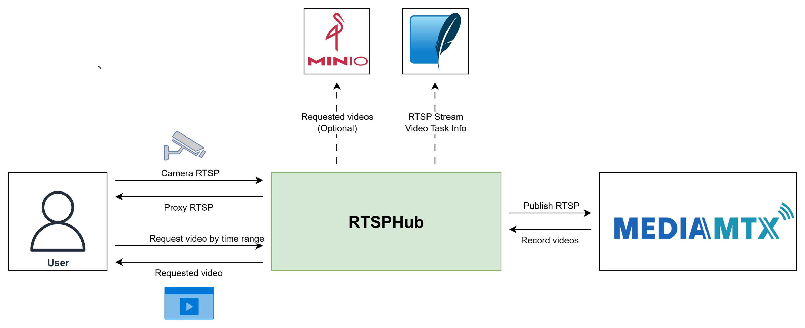

# RTSPHub

[](https://github.com/egliette/RTSPHub/actions/workflows/ci.yml)

[](https://github.com/egliette/RTSPHub/actions/workflows/publish-release.yml)

A FastAPI-based recording service that connects to RTSP streams, proxies them via MediaMTX, and provides APIs to record and store videos locally or in MinIO.



## 1. Overview

RTSPHub is a service designed for camera-related tasks and computer vision applications. It leverages [**MediaMTX**](https://github.com/bluenviron/mediamtx) and provides APIs to retrieve recorded video content based on specific time ranges - a feature not yet available in MediaMTX. This is particularly useful for:

- **Object Detection Tasks**: Extract specific video segments when objects are detected
- **Evidence Collection**: Retrieve video footage for specific time periods
- **Computer Vision Pipelines**: Access historical video data for analysis
- **Surveillance Systems**: Manage multiple camera streams efficiently

## 2. Key Features

1. **Stream Management**: Create proxy streams, monitor health, and manage streams via REST API with automatic recording
2. **Video Retrieval**: Provide API to return requested video based on time range
3. **Storage Options**: Local filesystem or MinIO object storage with presigned URLs
4. **Data Persistence**: Store stream information and task metadata in SQLite

## 3. Installation

### Using Docker Compose

1. **Clone the repository:**
   ```bash
   git clone <repository-url>
   cd RTSPHub
   ```

2. **Create environment file:**
   ```bash
   cp .env.example .env
   # Edit .env with your configuration
   ```

3. **Build and start the services:**
   ```bash
   # For development
   ./scripts/dev-compose.sh

   # For production
   ./scripts/prod-compose.sh

   # For testing
   ./scripts/test-compose.sh
   ```

4. **Access the services:**
   - RTSPHub API: http://localhost:8000
   - MediaMTX: http://localhost:8889
   - MinIO Console: http://localhost:9001

## 4. API Endpoints

### Stream Management
- `POST /api/streams` - Create a new proxy stream
- `GET /api/streams` - List all active streams
- `DELETE /api/streams/{stream_id}` - Remove a stream
- `GET /api/streams/{stream_id}/health` - Check stream health

### Video Retrieval
- `POST /api/video-process/tasks` - Create video processing task
- `GET /api/video-process/tasks` - List all video tasks
- `GET /api/video-process/tasks/{task_id}` - Get task status
- `DELETE /api/video-process/tasks/{task_id}` - Delete task
- `DELETE /api/video-process/tasks/{task_id}/video` - Delete video file based on task ID

## 5. TODO

- [x] Handle edge case where the requested time range is currently being recorded
- [x] Handle edge case where the requested time range overlaps on the left with existing recorded videos (start_time < oldest_video_start_time < end_time)
- [x] Allow recording in the future (end time in the future)
- [x] Add route to request from time + duration
- [ ] Update to async implementation
- [ ] Auto generate documentation
